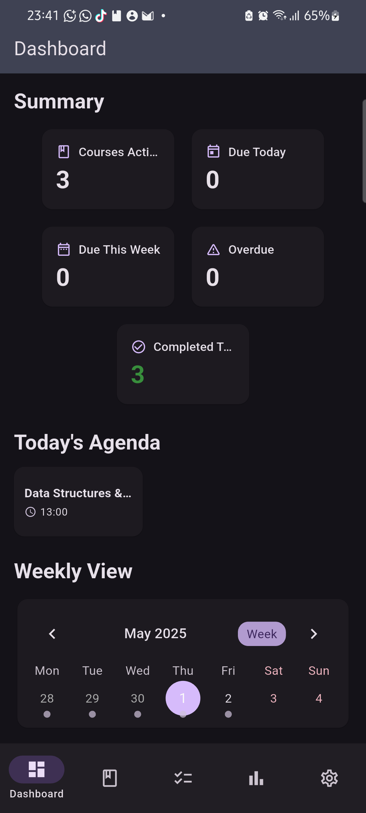
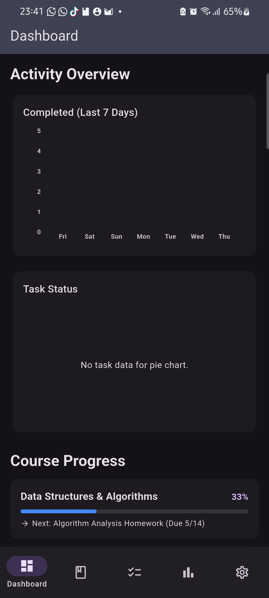
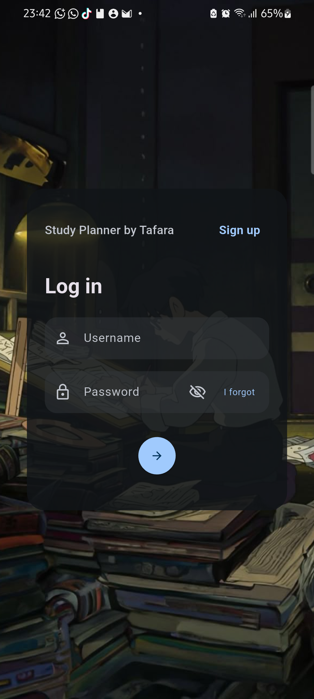
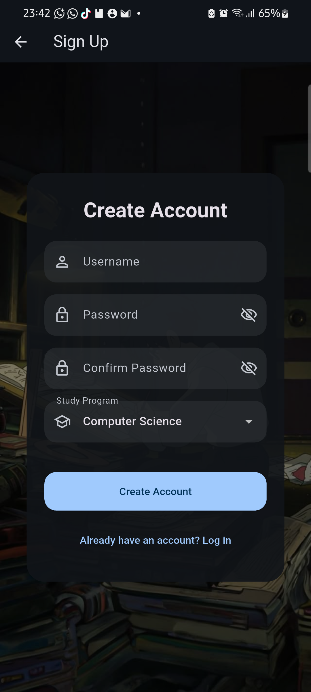
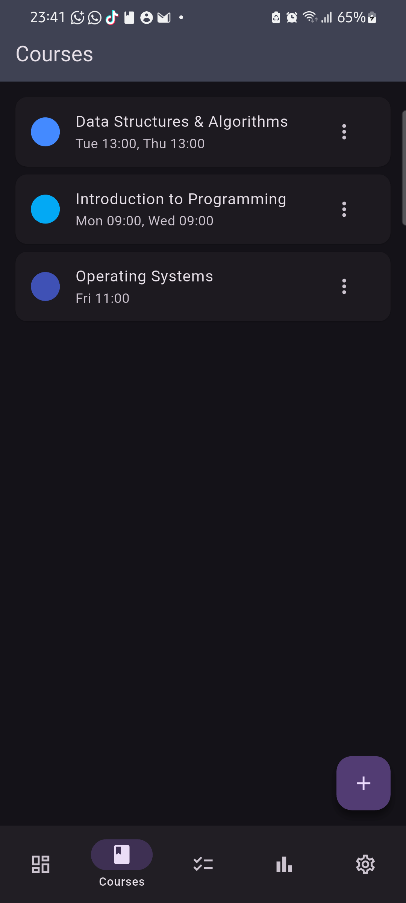
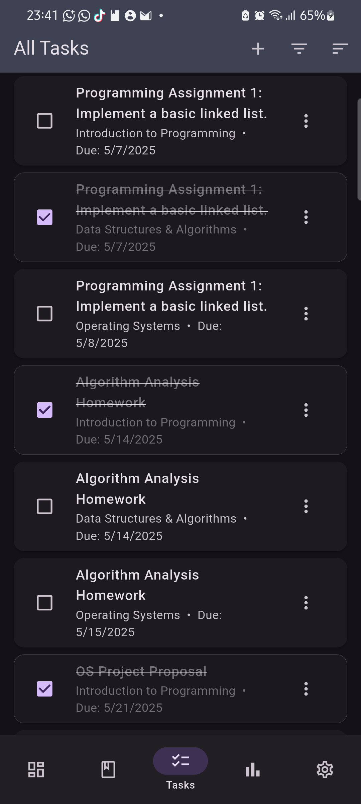
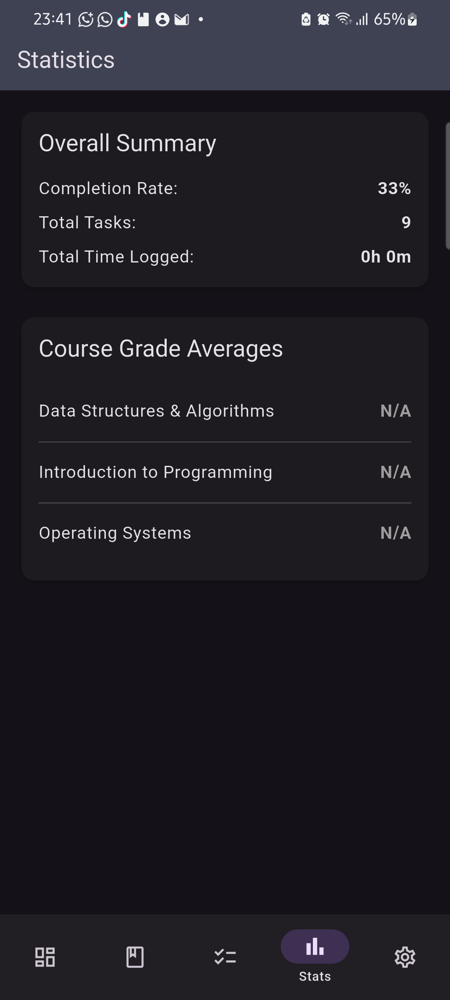
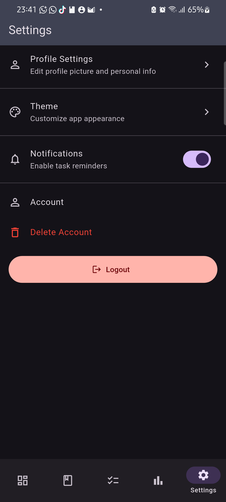
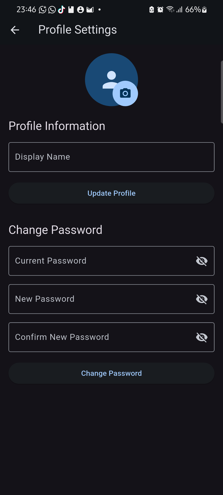
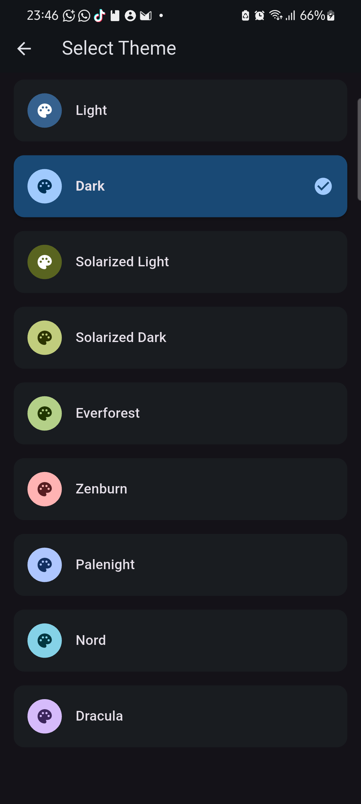

# HappyApp - Study Planner

A SwiftUI inspired Flutter study planner application designed to help students organize their academic life efficiently with comprehensive task management, course tracking, scheduling, and progress monitoring.

## ✨ Features

* **Dashboard Overview**: Central hub showing tasks due today, upcoming deadlines, and study schedule.
* **Course Management**: Create, edit and organize courses with custom colors and schedule details.
* **Task Management**:
  * Create tasks with titles, due dates, and priority levels (importance)
  * Mark tasks as complete/incomplete
  * Track time spent on tasks
  * Associate tasks with specific courses
  * Grade tracking with points earned/possible
* **Schedule Planning**:
  * Interactive calendar interface (day, week, month views)
  * View course schedules and task deadlines
  * Color-coded events based on course
* **Progress Tracking**:
  * Visual progress indicators for courses and tasks
  * Statistics dashboard with charts showing completion trends
  * Time tracking for study sessions
* **User Authentication**:
  * User registration and login
  * Profile management
* **UI Features**:
  * Light and dark mode themes
  * Customizable UI
  * Animated transitions and elements

## 📱 Screenshots

### Dashboard
<p float="left">
  
  
</p>

### Authentication
<p float="left">
  
  
</p>

### Main Screens
<p float="left">
  
  
</p>

### Analytics and Settings
<p float="left">
  
  
</p>

### User and Themes
<p float="left">
  
  
</p>

## 🛠️ Technology Stack

- **Framework**: Flutter
- **Language**: Dart
- **State Management**: Provider pattern
- **Data Persistence**:
  * SQLite database (sqflite)
  * Shared preferences for app settings
- **UI Components & Enhancements**:
  * table_calendar: Calendar display and interaction
  * fl_chart: Data visualization with charts
  * flutter_animate: UI animations
  * google_fonts: Typography enhancement
- **Utilities**:
  * UUID generation (uuid)
  * Collection utilities (collection)
  * Date/time formatting (intl)
  * File system access (path_provider, path)
  * Image handling (image_picker)
  * Device features (vibration)

## ⚙️ Installation

### Prerequisites
- Flutter SDK (^3.7.2)
- Dart SDK
- Android Studio / VS Code / Xcode
- Git

### Setup Steps

1. Clone the repository:
   ```bash
   git clone https://github.com/TafaraObed/happyapp.git
   cd happyapp
   ```

2. Install dependencies:
   ```bash
   flutter pub get
   ```

3. Run the application:
   ```bash
   flutter run
   ```

## 📁 Project Structure

```
happyapp/
├── lib/                              # Main source code
│   ├── main.dart                     # Application entry point (478 lines)
│   ├── helpers/                      # Database and utility helpers
│   │   ├── database_helper.dart      # SQLite database management (761 lines)
│   │   └── database_sync_manager.dart # Data synchronization (138 lines)
│   ├── models/                       # Data models
│   │   ├── course.dart               # Course data model (125 lines)
│   │   ├── predefined_programs.dart  # Predefined academic programs (224 lines)
│   │   ├── program.dart              # Academic program model (58 lines)
│   │   ├── schedule_entry.dart       # Schedule data model (58 lines)
│   │   ├── task.dart                 # Task data model (188 lines)
│   │   ├── time_log_entry.dart       # Time tracking model (36 lines)
│   │   └── user.dart                 # User authentication model (38 lines)
│   ├── providers/                    # State management
│   │   ├── auth_provider.dart        # Authentication state management (160 lines)
│   │   ├── settings_provider.dart    # App settings management (159 lines)
│   │   ├── tasks_provider.dart       # Task state management (320 lines)
│   │   └── theme_provider.dart       # Theme state management (161 lines)
│   ├── screens/                      # UI screens
│   │   ├── add_course_screen.dart    # Course creation UI (450 lines)
│   │   ├── add_task_screen.dart      # Task creation UI (306 lines)
│   │   ├── course_detail_screen.dart # Course details view (275 lines)
│   │   ├── course_list_screen.dart   # Course listing (135 lines)
│   │   ├── dashboard_screen.dart     # Main dashboard (1045 lines)
│   │   ├── login_screen.dart         # Authentication UI (294 lines)
│   │   ├── profile_screen.dart       # User profile management (304 lines)
│   │   ├── predefined_courses_screen.dart # Predefined courses selection (190 lines)
│   │   ├── settings_screen.dart      # App settings (228 lines)
│   │   ├── signup_screen.dart        # User registration (449 lines)
│   │   ├── stats_screen.dart         # Statistics and analytics (238 lines)
│   │   ├── task_detail_screen.dart   # Task details view (158 lines)
│   │   ├── task_list_screen.dart     # Task listing and management (742 lines)
│   │   └── theme_selection_screen.dart # Theme customization (127 lines)
│   ├── services/                     # Business logic services
│   │   ├── predefined_courses_service.dart # Course template management (75 lines)
│   │   └── prioritization_service.dart # Task prioritization logic (69 lines)
│   ├── themes/                       # Theme configurations
│   │   └── app_themes.dart           # Application theme definitions (531 lines)
│   ├── utils/                        # Utility functions
│   │   └── task_filter.dart          # Task filtering logic (10 lines)
│   └── widgets/                      # Reusable UI components
│       └── tap_scale_container.dart  # Animation wrapper for UI elements (77 lines)
├── assets/                           # Static assets
│   └── images/
│       ├── study_background.jpg      # Dark mode background
│       └── study_light_background.jpg # Light mode background
├── screenshots/                      # Application screenshots for documentation
│   ├── Course_Screen.png
│   ├── Dashboard_01.png
│   ├── Dashboard_02.png
│   ├── Login_screen.png
│   ├── Profile_settings_screen.png
│   ├── Settings_screen.png
│   ├── Signup_screen.png
│   ├── Stats_screen.png
│   ├── Tasks_screen.png
│   └── Themes.png
├── android/                          # Android platform code
├── ios/                              # iOS platform code
├── web/                              # Web platform code
├── windows/                          # Windows platform code
├── macos/                            # macOS platform code
├── linux/                            # Linux platform code
├── test/                             # Testing directory
├── pubspec.yaml                      # Project dependencies and metadata
└── README.md                         # Project documentation
```

## 📊 Database Schema

The app uses SQLite for data persistence with the following key tables:
- users: User authentication data
- courses: Course information and metadata
- tasks: Task details including completion status, due dates
- time_logs: Time tracking for study sessions

## 🔄 State Management

The application uses the Provider pattern for state management:
- AuthProvider: Manages user authentication state
- ThemeProvider: Handles theme preferences
- SettingsProvider: Tracks app settings
- TasksProvider: Manages task data operations

## 📱 Supported Platforms

The app is designed to run on multiple platforms:
- Android
- iOS
- Web
- Windows
- macOS
- Linux

## 📦 Dependencies

### Main Dependencies
- flutter: The Flutter SDK
- cupertino_icons: iOS style icons
- uuid: For generating unique IDs
- collection: Utility collections classes
- table_calendar: A highly customizable Flutter Calendar widget
- intl: Internationalization and localization utilities
- shared_preferences: For persistent storage (simple data)
- provider: State management
- flutter_animate: Adds declarative animations
- google_fonts: Includes fonts from fonts.google.com
- fl_chart: A library to draw charts in Flutter
- sqflite: SQLite database plugin
- path_provider: For finding commonly used locations on the filesystem
- path: Path manipulation utilities
- image_picker: For selecting images from the device gallery or camera
- vibration: Plugin for device vibration

### Development Dependencies
- change_app_package_name: Utility to change app package name
- rename_app: Utility to rename the app
- flutter_test: Flutter testing framework
- flutter_lints: Recommended lints for Flutter projects

## 🔧 Key Features Implementation

### Authentication System
The app implements a user authentication system that supports registration, login, and persistent sessions using a combination of `AuthProvider` and SQLite storage.

### Course Management
Courses are managed through a dedicated data model that supports:
- Custom course creation with name, instructor, and color properties
- Predefined course templates organized by academic programs
- Schedule entries for recurring class times

### Task System
Tasks are the core organizational unit for student work and include:
- Due date tracking with overdue detection
- Priority levels (importance)
- Association with specific courses
- Time tracking for study sessions
- Grade recording (points earned/possible)

### Dashboard and Analytics
The app features a comprehensive dashboard with:
- Calendar views for schedule visualization
- Task status overview (due today, upcoming, overdue)
- Progress charts including weekly task completion
- Course completion percentage visualization

### Data Persistence
The app uses a multi-layered approach for data storage:
- SQLite database for structured data (courses, tasks, user information)
- Shared preferences for app settings and themes
- JSON serialization for complex data structures

## 🤝 Contributing

Contributions are welcome! Please follow these steps:

1. Fork the repository
2. Create your feature branch (`git checkout -b feature/your-feature`)
3. Commit your changes (`git commit -m 'Add some feature'`)
4. Push to the branch (`git push origin feature/your-feature`)
5. Open a Pull Request

Please adhere to Flutter best practices and ensure tests pass.

## 📄 License

MIT License

Copyright (c) 2023 HappyApp Co.

Permission is hereby granted, free of charge, to any person obtaining a copy
of this software and associated documentation files (the "Software"), to deal
in the Software without restriction, including without limitation the rights
to use, copy, modify, merge, publish, distribute, sublicense, and/or sell
copies of the Software, and to permit persons to whom the Software is
furnished to do so, subject to the following conditions:

The above copyright notice and this permission notice shall be included in all
copies or substantial portions of the Software.

THE SOFTWARE IS PROVIDED "AS IS", WITHOUT WARRANTY OF ANY KIND, EXPRESS OR
IMPLIED, INCLUDING BUT NOT LIMITED TO THE WARRANTIES OF MERCHANTABILITY,
FITNESS FOR A PARTICULAR PURPOSE AND NONINFRINGEMENT. IN NO EVENT SHALL THE
AUTHORS OR COPYRIGHT HOLDERS BE LIABLE FOR ANY CLAIM, DAMAGES OR OTHER
LIABILITY, WHETHER IN AN ACTION OF CONTRACT, TORT OR OTHERWISE, ARISING FROM,
OUT OF OR IN CONNECTION WITH THE SOFTWARE OR THE USE OR OTHER DEALINGS IN THE
SOFTWARE.

---

Built with 💙 using Flutter.
